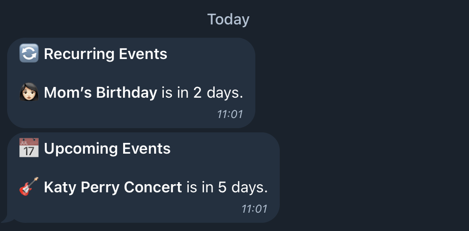
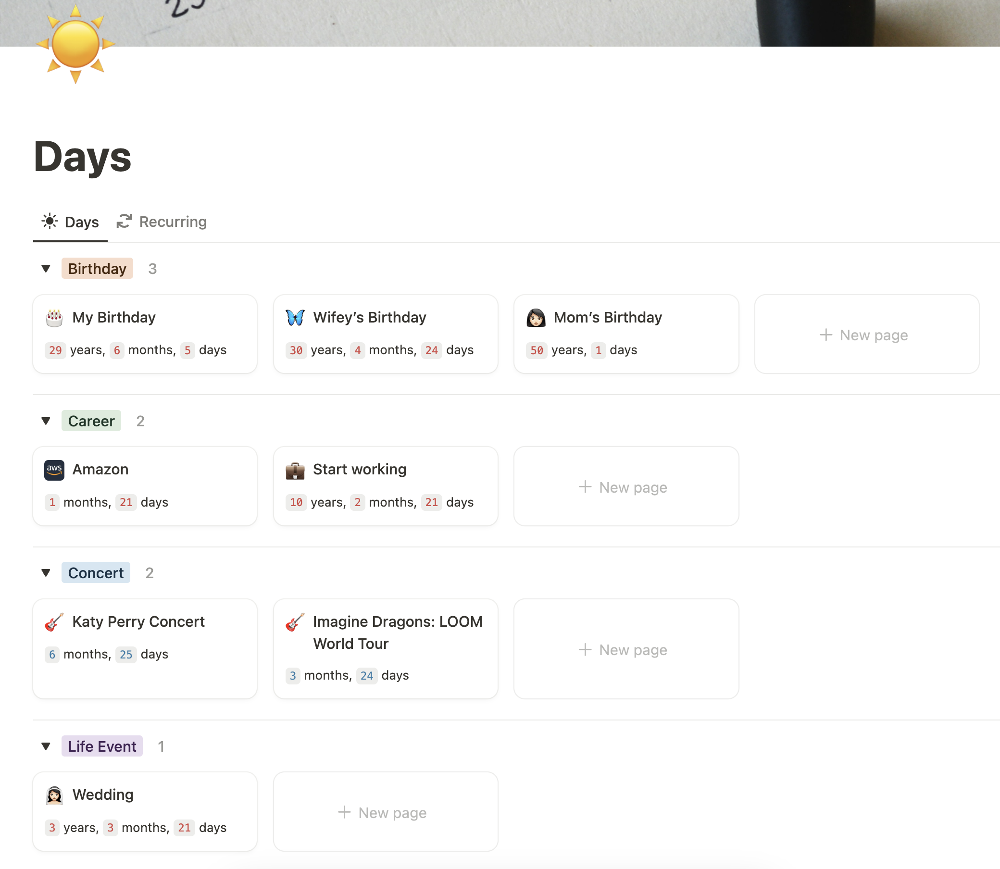
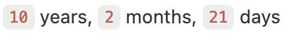
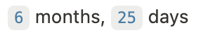

# Notion Telegram Event Reminder

Daily reminder for events on Telegram:


Notion Page:

[Notion Template](https://ehcaning.notion.site/template-days)

## Usage

### Notion

1. Clone [this Notion template](https://ehcaning.notion.site/template-days) into your Notion workspace.
2. Input your important dates. They can be in the past or future:
    - **Past**: 
    - **Future**: 
3. Specify the days you want to be reminded before the event by entering comma-separated values in the `Remind In` field. i.e. `7,14,30`

### Run the Code Locally

1. Clone the repository and create a copy of the `.env.example` file named `.env`. Enter the required secrets in the `.env` file.
2. Run the script:
    ```bash
    env $(cat .env | xargs) node app.js
    ```

### Run with AWS Lambda

1. Log in to your AWS account and create a new function:
    - **Runtime**: `Node.js 22.x`
2. Run `npm run zip` to generate a zip file and upload it in the `Code source` section.
3. Go to the `Configuration` tab:
    - Under **General configuration**, click on `Edit` and increase the `Memory` to `256 MB` and the `Timeout` to `10 seconds`.
    - Under **Environment variables**, manually enter the values from your `.env` file.
4. Go back to the `Code` tab and click on `Test`. You should see the same result as your local run.
5. Schedule a cron job to run this script daily:
    - From the **Function overview**, click on `Add trigger`.
    - Choose `EventBridge`.
    - Select `Create a new role` and provide a name.
    - Under **Schedule expression**, enter your desired schedule. For example, `cron(0 6 * * ? *)` will trigger this function every day at 6 AM UTC.
