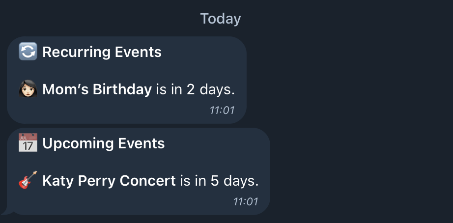
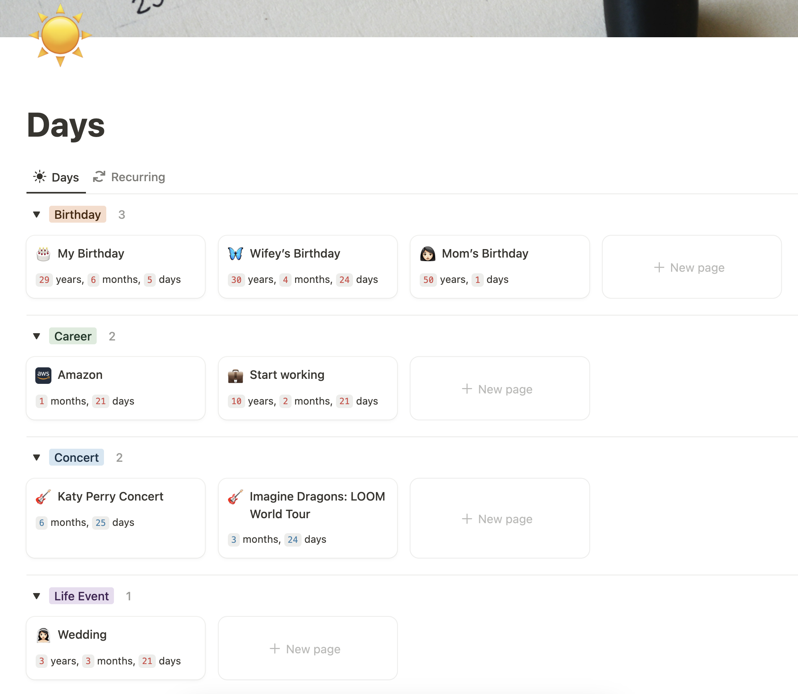
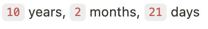
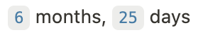

# Notion Telegram Event Reminder

Daily reminder for events on Telegram:


Notion Page:

[Notion Template](https://ehcaning.notion.site/template-days)

## Usage

### Notion

1. Clone [this Notion template](https://ehcaning.notion.site/template-days) into your Notion workspace.
2. Input your important dates. They can be in the past or future:
    - **Past**: 
    - **Future**: 
3. Specify the days you want to be reminded before the event by entering comma-separated values in the `Remind In` field. i.e. `7,14,30`

### Run the Code Locally

1. Clone the repository and create a copy of the `.env.example` file named `.env`. Enter the required secrets in the `.env` file.
3. Install dependencies:
    ```bash
    bun install
    ```
2. Run the script:
    ```bash
    bun run
    ```